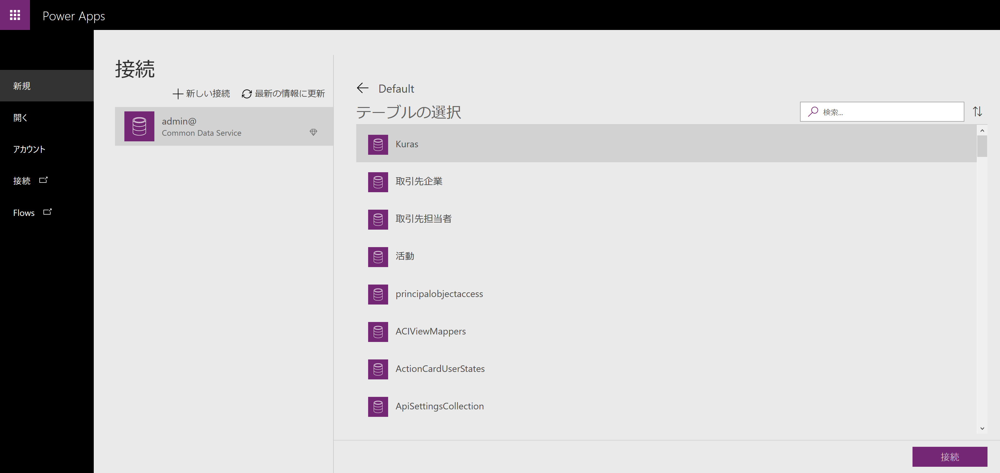

# PowerApps-SakeLedger

PowerApps で CRUD アプリを実装

---

# 1. 捨てアドを取得

[sute.jp](https://sute.jp/)

# 2. Dynamics 365 の試用版にサインアップ

[Microsoft Dynamics 365 の概要](https://dynamics.microsoft.com/ja-jp/get-started/) から、 [無料試用版にサインアップします](https://go.microsoft.com/fwlink/?LinkId=2017174&clcid=0x411) をクリックする

# 3. Power Apps にサインイン

[Power Apps](https://make.powerapps.com/) を開く

[ソリューション](solutions) を開くと、 **新しい環境の作成** ボタンをクリックし、新しい環境を用意する

- 環境名
- - `SakeEnv`
- 地域
- - `米国`
- 環境の種類
- - 実稼働

**データベースの作成** をクリックし、以下の設定値を入力した後に **自分のデータベースを作成** をクリック

- 通貨
- - `JPY`
- 言語
- - `Japanese`
- サンプルアプリとデータを含める
- - 有効

# 4. エンティティを作成

**データ** > **エンティティ** をクリックし、エンティティ画面を表示

**新しいエンティティ** をクリックし、エンティティを作成

以下の設定値を入力した後に **作成** をクリック

- 表示名
- - `Kura`
- 表示名の複数形
- - `Kuras`
- 名前
- - cra0c\_ `Kura`
- プライマリ フィールド
- - 表示名
- - - `Name`
- - 名前
- - - cra0c\_ `Name`
- 添付ファイルを有効にする (メモとファイルを含む)
- - `有効`

# 5. アプリを作成

先程作成した環境が選択されていることを確認し、 **データから開始** > **Common Data Services** をクリック

**作成** をクリック

**テーブルの選択** で、先程作成したエンティティ `Kura` を選択し、 **接続** をクリック

最低限の CRUD 処理を含むアプリが生成される

**ファイル** > **設定**　を開き、 **名前** を入力

**ファイル** > **名前を付けて保存**　を開き、 **保存** をクリック
